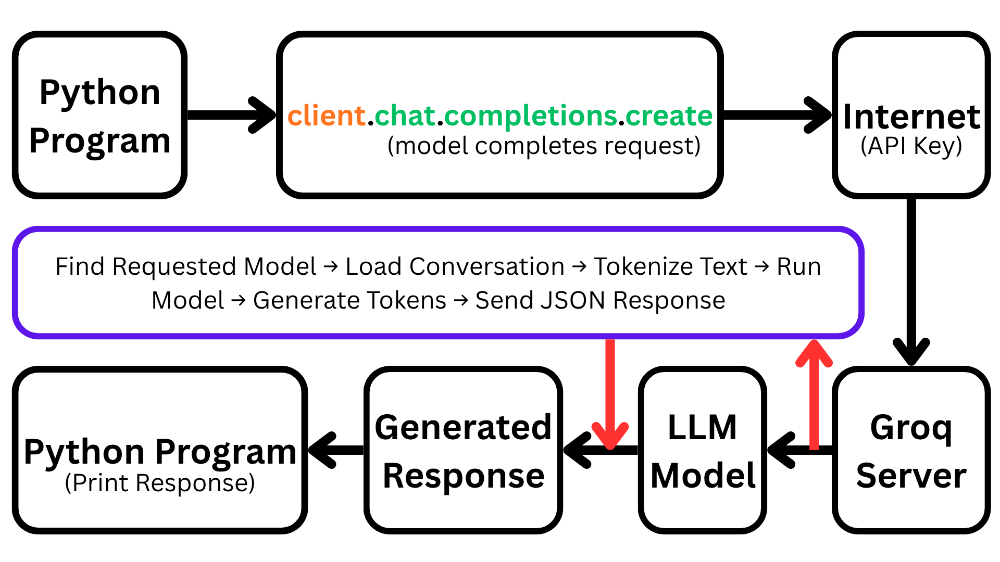
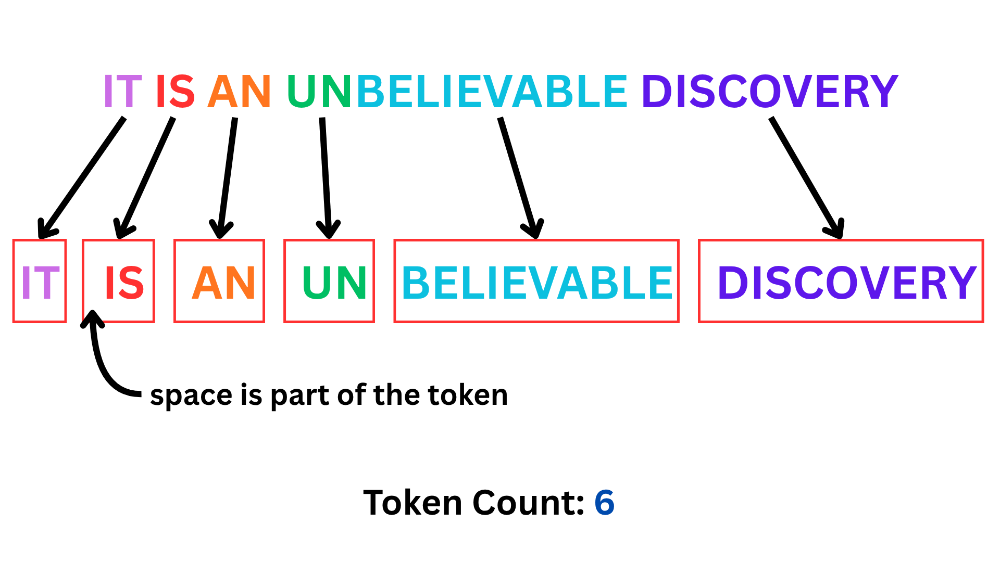

# How does an LLM API work?
Instead of downloading a 70B parameter model to the computer, send a prompt to Groq's servers (free tier). Their servers run the model and send back only the generated response.

(For more info on Groq API visit: [Groq Documentation](https://console.groq.com/docs/quickstart))

## How it works:



```python
client = Groq()
```
calls the Groq Client which is then ready to send requests

```python
client.chat.completions.create(...)
```

Arguments Taken:
1. **model**: choose model of your own choice
2. **temperature**: 1.0 
3. **max_tokens**: 1024
4. **messages**: {"role":"", "content":""}

### TOKENS
Tokens are the currency with which the LLM communicates. Every prompt, every request, every context etc. all work using tokens. Tokens are individual pieces of memory that the AI works with. 

Tokens can be word-level, subword-level or character-level. The subword-level tokenization is the most commonly used and works like this:



`max_tokens` sets the upper limit of the output generation. Meaning, it can only generate output tokens till the limit of max_tokens. If max_tokens is not specified, the model shifts to default maximum limit (usually 8000 tokens).

### TEMPERATURE
The LLM's response is built on probabilities, i.e. a giant guessing machine, for what the next word should be. Temperature controls creativity, randomness or predictability of the AI's response. 

**Prompt**: The cat sat on the....
1. **mat** - 60% chance
2. **rug** - 20% chance
3. **couch** - 15% chance
4. **moon** - 0.1% chance

-> For temperature = 0.0, it will pick the absolute highest probable word (in this case, "mat").

-> For temperature = 0.5-0.7, it is the default setting for most chatbot. More balanced; it will usually pick "mat", but occasionally use "rug" or "couch".

-> For temperature > 1.0, flattens the probabilities and the chatbot starts taking risks hence unexpected responses (like "moon") might appear in the response. Too high (1.7 or 2.0) causes response to dissolve into pure, incoherent gibberish.

### MESSAGES
Critical part of how the AI's memory is defined. An AI conversation is built out of three main characters, defined by the "role" key:

| Role | What it does |
|---|---|
| `system` | Sets the behaviour, tone and boundaries for the AI before the conversation even starts. If not specified the Ai uses its default personality |
| `user` | Contains the user questions, prompts, or instructions |
| `assistant` | Feed the AI's own past responses back into the script so it remembers what it previously said |


What Groq returns when we call `message.choices[0].message.content`:-
```Python
{
  "choices":[
      {
          "message":{
              "content":"content"
          }
      }
  ]
}
```